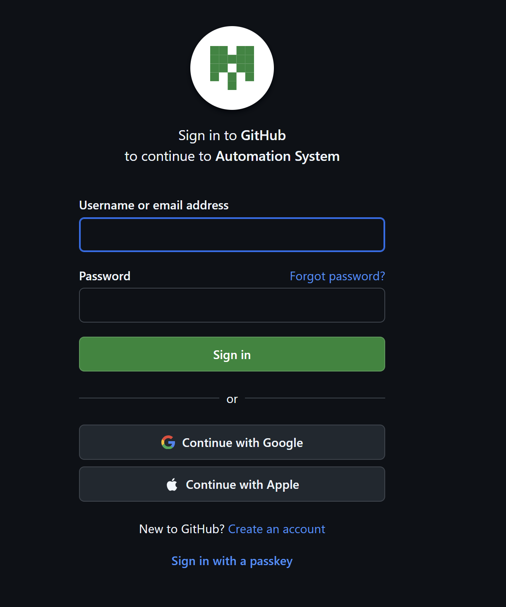
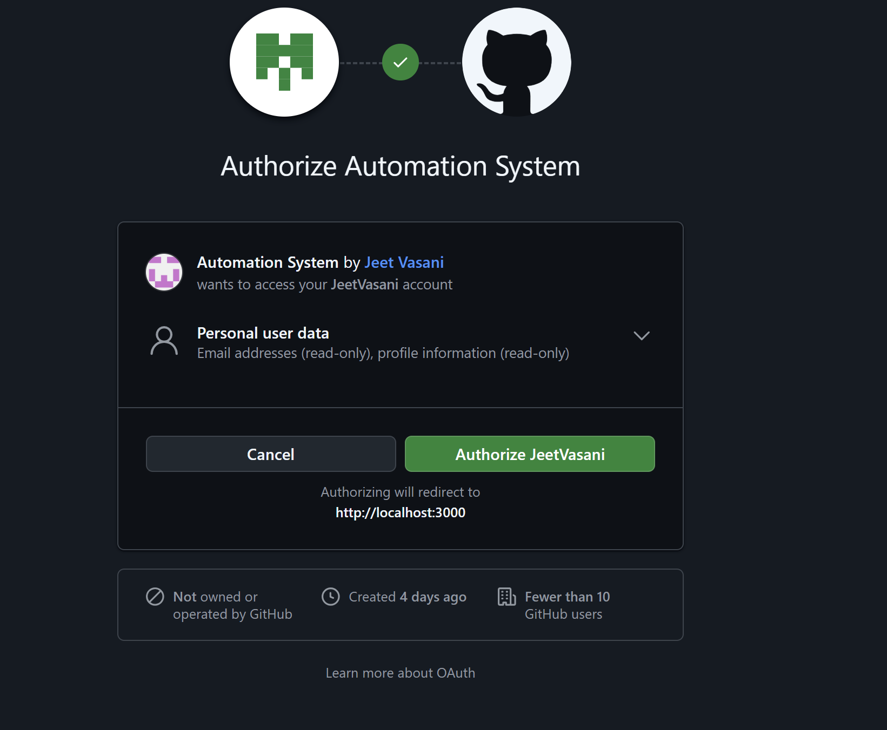
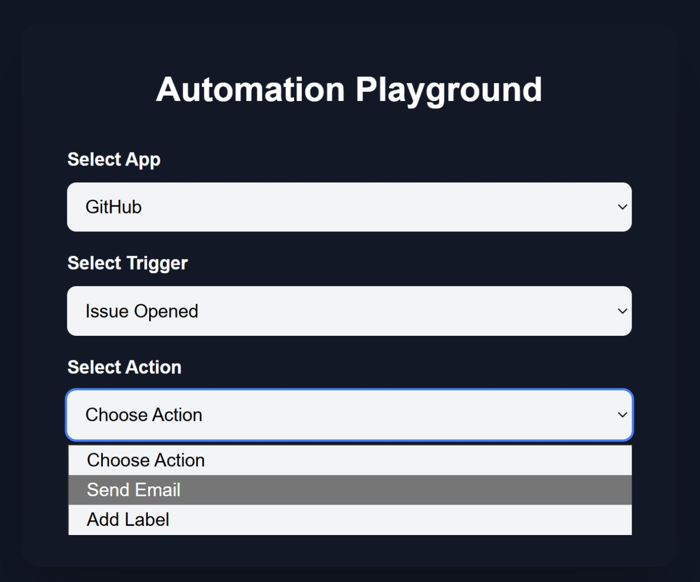
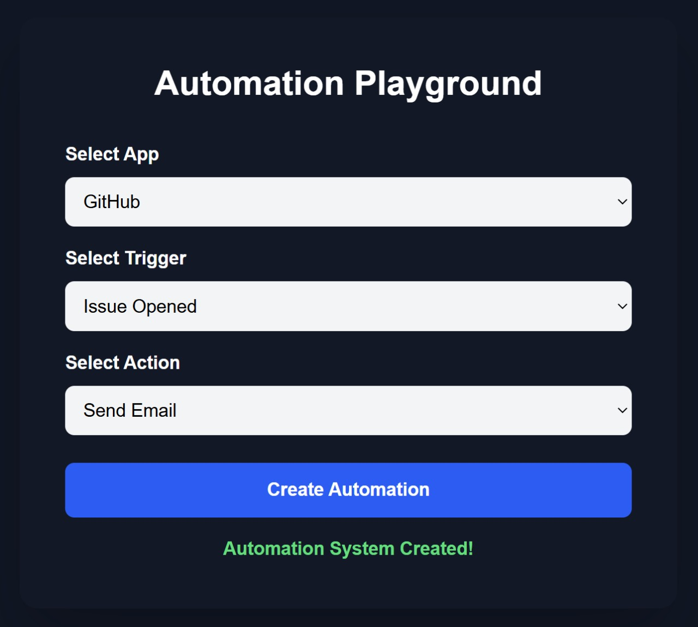
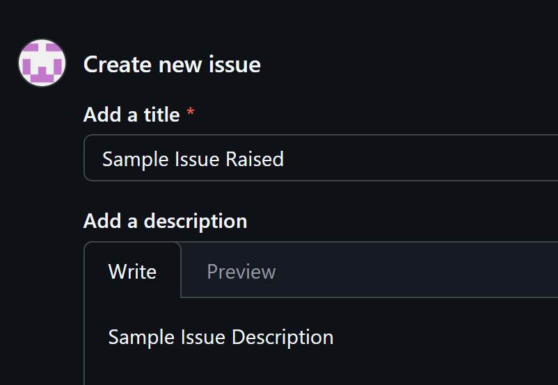
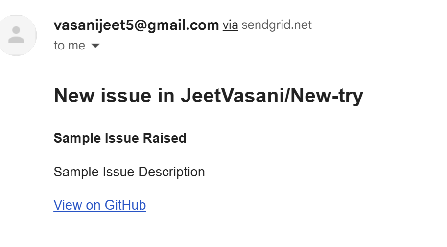

# Pipline-Automation

A workflow automation system that lets you create pipelines connecting triggers from one service to actions in another. Works like a lightweight automation engine where events from GitHub or other apps can automatically trigger predefined steps.

## What This Project Does

1. Let's the user connect external apps [Currently Github and Email] 
2. Receive triggers on indivual apps 
3. Perform select action by user
   
## Features

1. OAuth integrations for secure app connections.  
2. Modular trigger and action system across multiple apps for adding new services.  
3. Database using PostgreSQL.

## Screenshots of working

### Note: These screenshots are from an earlier build. All features shown are still maintained in backend, but the UI is currently being redesigned.

<p>
  
  
</p>

<p>
  
  
</p>

<p>
  
  
</p>


## Tech Stack

1. Backend: Python with FastAPI  
2. ORM: SQLAlchemy  
3. Database: PostgreSQL  
4. Frontend: TypeScript with Tailwind


## Setup Instructions

### Prerequisites

- Python 3  
- PostgreSQL  
- Node.js  
- pnpm or npm

## Clone Repo

```bash
git clone https://github.com/JeetVasani/Pipline-Automation
cd Pipline-Automation
```
### Backend setup

```bash
cd backend
uvicorn main:app --reload --host 0.0.0.0 --port 8000
```

### Frontend setup

```bash
cd ../frontend/my-app
pnpm install
pnpm run dev
```

